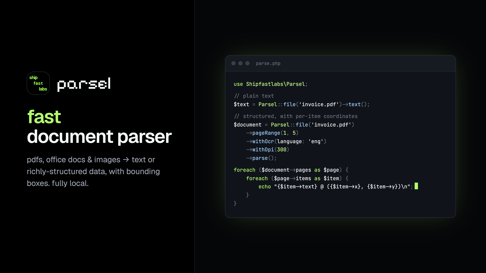

# Parsel

<p align="center">
    
<p align="center">
    <a href="https://github.com/shipfastlabs/parsel/actions"></a>
    <a href="https://packagist.org/packages/shipfastlabs/parsel"></a>
    <a href="https://packagist.org/packages/shipfastlabs/parsel"></a>
    <a href="https://packagist.org/packages/shipfastlabs/parsel"></a>
</p>
</p>

Parsel provides an expressive PHP API for parsing PDFs, Office documents, and images. Your documents are processed locally, allowing you to extract plain text, structured page data, coordinates, and screenshots without sending files to an external service.

Parsel may return plain text, structured document data, page screenshots, or one page at a time for larger documents. It is designed to feel natural in PHP applications while still giving you access to advanced parser options when you need them.

```php
use Shipfastlabs\Parsel;

$text = Parsel::file('invoice.pdf')->text();

$document = Parsel::file('invoice.pdf')
    ->pageRange(1, 5)
    ->withOcr(language: 'eng')
    ->withDpi(300)
    ->parse();

foreach ($document->pages as $page) {
    foreach ($page->items as $item) {
        echo "{$item->text} @ ({$item->x}, {$item->y})\n";
    }
}
```

Parsel requires PHP 8.4 or greater and the `lit` binary.

## Installation

You may install Parsel via Composer:

```bash
composer require shipfastlabs/parsel
```

Parsel does not install liteparse for you. Before parsing documents, you should install the `lit` binary using the toolchain that is most appropriate for your environment:

```bash
cargo install liteparse
pip install liteparse
npm i -g @llamaindex/liteparse
```

When parsing Office documents or images, liteparse may also require LibreOffice and ImageMagick to be installed on the host machine. OCR support uses Tesseract through liteparse.

## Parsing Files

The `file` method creates a parser instance for a document that already exists on disk. Once a source has been selected, you may choose how the parsed output should be returned.

```php
use Shipfastlabs\Parsel;

$text = Parsel::file('/path/to/report.pdf')->text();
```

You may also parse raw bytes. This is useful when working with uploaded files, database blobs, or documents that have not been persisted to disk. Because byte sources do not include a filename, you should provide the file extension.

```php
$document = Parsel::bytes($uploadedBytes, 'pdf')->parse();
```

Parsel may be used with PDFs, Word documents, spreadsheets, presentations, and images. The same fluent API is used for each supported file type:

```php
$text = Parsel::file('contract.docx')->text();

$rows = Parsel::file('report.xlsx')->text();

$slides = Parsel::file('deck.pptx')->text();

$scan = Parsel::file('receipt.png')
    ->withOcr()
    ->text();

$photo = Parsel::file('invoice.jpg')
    ->withOcr(language: 'eng')
    ->parse();
```

## Plain Text

The `text` method returns the parsed document text as a string. Parsel removes page header markers from text output before returning it.

```php
$text = Parsel::file('document.pdf')
    ->withoutOcr()
    ->text();
```

## Structured Documents

The `parse` method returns a `Document` object containing the document text, metadata, pages, and positioned text items. This is useful when you need coordinates, font information, or OCR confidence values.

```php
$document = Parsel::file('document.pdf')->parse();

echo $document->text;
echo $document->pageCount();

foreach ($document->pages as $page) {
    foreach ($page->items as $item) {
        echo $item->text;
    }
}
```

The document may also be returned as an array:

```php
$array = Parsel::file('document.pdf')->toArray();
```

## Page Selection

The `page`, `pages`, and `pageRange` methods may be used to limit parsing to specific pages. These methods are additive, so you may combine multiple calls before parsing the document.

```php
Parsel::file('document.pdf')->page(7);

Parsel::file('document.pdf')->pages(1, 3, 5);

Parsel::file('document.pdf')->pages('1-5', 10);

Parsel::file('document.pdf')->pageRange(1, 5);

Parsel::file('document.pdf')->pageRange(1, 5)->page(10);
```

If you only need to limit how many pages are parsed, you may use the `maxPages` method:

```php
Parsel::file('document.pdf')->maxPages(50)->text();
```

## OCR

OCR is disabled by default so that parsing remains fast and predictable. You may enable OCR using the `withOcr` method:

```php
$text = Parsel::file('scan.pdf')->withOcr()->text();
```

The `withOcr` method accepts named arguments for the most common OCR options:

```php
$text = Parsel::file('scan.pdf')
    ->withOcr(
        language: 'fra',
        tessdataPath: '/usr/share/tessdata',
        serverUrl: 'http://localhost:8828/ocr',
        workers: 8,
    )
    ->text();
```

If you would like to be explicit that OCR should not be used, you may call `withoutOcr`:

```php
$text = Parsel::file('document.pdf')->withoutOcr()->text();
```

## Rendering Options

Parsel includes convenience methods for common parser options such as rendering DPI, small text preservation, encrypted documents, and per-call process settings.

```php
Parsel::file('document.pdf')->withDpi(300);

Parsel::file('document.pdf')->preserveSmallText();

Parsel::file('secret.pdf')->withPassword('hunter2');

Parsel::file('document.pdf')->withBinary('/usr/local/bin/lit');

Parsel::file('document.pdf')->withTimeout(120);
```

## Additional Options

If you need to pass a flag that Parsel does not yet provide as a dedicated method, you may pass the option directly using the `option` method. Boolean options may be passed without a value, while options that require a value may receive one as the second argument.

```php
Parsel::file('document.pdf')->option('some-new-flag');

Parsel::file('document.pdf')->option('some-new-flag', 42);
```

## Saving Output

The `save` method writes parsed output to disk and returns the path that was written. When the target path ends in `.json`, Parsel will write JSON output. For all other extensions, Parsel will write plain text.

```php
Parsel::file('document.pdf')->save('document.txt');

Parsel::file('document.pdf')->save('document.json');
```

## Screenshots

You may use the `screenshots` method to render page screenshots into a directory. The method returns the image files found in the output directory after parsing has finished.

```php
$screenshots = Parsel::file('document.pdf')
    ->pageRange(1, 5)
    ->screenshots('/tmp/parsel-pages');
```

For predictable results, you should pass a dedicated output directory that does not contain unrelated files.

## Streaming Large Documents

The `parse` and `toArray` methods load the parsed document into memory. When working with large documents, you may use `lazyPages` to process one page at a time.

```php
foreach (Parsel::file('large-document.pdf')->lazyPages() as $page) {
    foreach ($page->items as $item) {
        // Process one page at a time...
    }
}
```

This allows Parsel to read pages incrementally instead of keeping the full document in memory.

## Document Data

A parsed `Document` contains the full text, metadata, and a list of pages. Each page contains its dimensions, page text, and text items with position data.

```php
$document->text;
$document->metadata;
$document->pages;
$document->pageCount();

$page->number;
$page->width;
$page->height;
$page->text;
$page->items;

$item->text;
$item->x;
$item->y;
$item->width;
$item->height;
$item->fontName;
$item->fontSize;
$item->confidence;
```

## Binary Resolution

When Parsel needs to parse a document, it resolves the `lit` binary in the following order:

1. The per-call binary configured with `withBinary`.
2. The global binary configured with `Parsel::usingBinary`.
3. The `PARSEL_LIT_BINARY` environment variable.
4. The `lit` binary available on the system `PATH`.

If no binary can be resolved, Parsel will throw a `BinaryNotFoundException`.

```php
Parsel::usingBinary('/usr/local/bin/lit');

Parsel::defaultTimeout(120);
```

## Testing

Parsel includes a fake runner that allows your tests to exercise parsing code without spawning the real binary. Response keys are matched against the command line as substrings. When multiple responses match, the longest matching key is used.

```php
use Shipfastlabs\Parsel;

$fake = Parsel::fake([
    '--format json' => file_get_contents(__DIR__.'/fixtures/lit-output.json'),
]);

$document = Parsel::file('invoice.pdf')->parse();

expect($fake->recordedCommands()[0])->toContain('--format', 'json');
```

String responses are returned as successful stdout. If you need control over the exit code or stderr, you may provide a `ProcessResult` instance instead.

## Development

Parsel uses Pint, Rector, PHPStan, and Pest to keep the codebase formatted and well tested.

```bash
composer lint
composer test:types
composer test:unit
composer test
```

The integration tests run against a real parser installation and are skipped when the `lit` binary is not available:

```bash
./vendor/bin/pest --group=integration
```

## Credits

Parsel is maintained by [Shipfastlabs](https://shipfastlabs.com) and released under the [MIT license](LICENSE.md).
