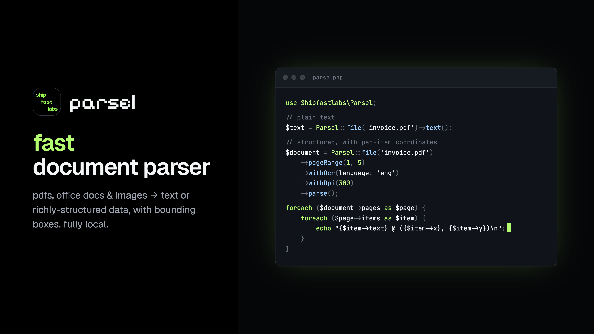

# Parsel

<p align="center">
    
</p>

<p align="center">
    <a href="https://github.com/shipfastlabs/parsel/actions"></a>
    <a href="https://packagist.org/packages/shipfastlabs/parsel"></a>
    <a href="https://packagist.org/packages/shipfastlabs/parsel"></a>
</p>

Parsel provides one expressive PHP API for document parsing, backed by interchangeable drivers. Version 1.0 includes local [LiteParse](https://github.com/run-llama/liteparse) and [AnyDoc](https://github.com/firecrawl/anydoc) drivers and public contracts for custom or future hosted providers.

```php
use Shipfastlabs\Parsel;

$markdown = Parsel::file('report.pdf')->markdown(); // LiteParse by default

$markdown = Parsel::driver('anydoc')
    ->file('report.docx')
    ->markdown();
```

Parsel requires PHP 8.4 or greater.

## Installation

```bash
composer require shipfastlabs/parsel
```

Install only the parser you use. With no `--driver`, the installer installs LiteParse:

```bash
vendor/bin/parsel-install
vendor/bin/parsel-install --driver=anydoc
vendor/bin/parsel-install --driver=all
```

LiteParse supports npm, pnpm, bun, pip, and cargo. AnyDoc supports npm, pnpm, and bun and requires Node.js 20 or newer.

```bash
vendor/bin/parsel-install --driver=liteparse --manager=cargo
vendor/bin/parsel-install --driver=anydoc --manager=npm
vendor/bin/parsel-install --driver=liteparse --with-system-dependencies
```

`vendor/bin/parsel-install-lit` remains as a compatibility alias.

## Drivers and capabilities

| Capability | LiteParse | AnyDoc |
| --- | --- | --- |
| Markdown | Yes | Yes |
| Plain text | Yes | No |
| Structured pages and coordinates | Yes | No |
| Lazy pages | Yes | No |
| Screenshots | Yes | No |
| OCR | Yes | No |

Calling an unavailable operation throws `UnsupportedCapabilityException` before the provider is executed. Parsel does not derive fake structured data or plain text from AnyDoc Markdown.

LiteParse remains the default driver, so existing basic calls continue to work:

```php
$text = Parsel::file('invoice.pdf')->text();
$document = Parsel::file('invoice.pdf')->parse();
$array = Parsel::file('invoice.pdf')->toArray();
```

Select AnyDoc explicitly or change the process-wide default:

```php
Parsel::driver('anydoc')->file('book.epub')->markdown();

Parsel::defaultDriver('anydoc');
Parsel::file('book.epub')->markdown();
```

For dependency injection and long-running applications, use an instance:

```php
use Shipfastlabs\Parsel\ParselManager;

$parsel = new ParselManager;
$markdown = $parsel->driver('anydoc')->file('report.docx')->markdown();
```

## Sources and common options

Both drivers accept paths and raw bytes. Byte sources require an extension so signature-less formats such as CSV can be identified reliably.

```php
$markdown = Parsel::file('/path/to/report.pdf')->markdown();
$markdown = Parsel::bytes($uploadedBytes, 'pdf')->markdown();

$markdown = Parsel::driver('anydoc')
    ->bytes($csvBytes, 'csv')
    ->withProviderOptions(['format' => 'csv'])
    ->markdown();
```

Timeout is portable across drivers:

```php
Parsel::file('report.pdf')->withTimeout(120)->markdown();
```

`save()` selects the corresponding capability from the extension. Both drivers support `.md` and `.markdown`; LiteParse additionally supports `.txt` and `.json`.

```php
Parsel::driver('anydoc')->file('report.docx')->save('report.md');
Parsel::file('report.pdf')->save('report.json');
```

## Provider options

Provider-specific behavior belongs in `withProviderOptions()`. It accepts a typed fluent object or a strict associative array.

```php
use Shipfastlabs\Parsel\Options\LiteParseOptions;

$options = LiteParseOptions::make()
    ->pageRange(1, 5)
    ->page(10)
    ->withOcr(language: 'eng', workers: 8)
    ->withDpi(300)
    ->preserveSmallText();

$document = Parsel::file('invoice.pdf')
    ->withProviderOptions($options)
    ->parse();
```

LiteParse options include page selection, maximum pages, OCR settings, DPI, small-text preservation, passwords, Markdown images and links, headers and footers, and a binary override.

```php
use Shipfastlabs\Parsel\Enums\ImageMode;

$markdown = Parsel::file('report.pdf')
    ->withProviderOptions(
        LiteParseOptions::make()
            ->withoutOcr()
            ->withImages(ImageMode::Embed, '/path/to/images')
            ->withoutLinks()
            ->keepHeadersAndFooters()
    )
    ->markdown();
```

AnyDoc supports explicit input format and binary overrides:

```php
use Shipfastlabs\Parsel\Options\AnyDocOptions;

$markdown = Parsel::driver('anydoc')
    ->file('data.csv')
    ->withProviderOptions(
        AnyDocOptions::make()->format('csv')
    )
    ->markdown();
```

Array keys are validated, so typos fail early. For a newly released upstream CLI flag, use the explicit escape hatch:

```php
$options = LiteParseOptions::make()->option('new-upstream-flag', 42);
$options = AnyDocOptions::make()->option('new-upstream-flag');
```

LiteParse `option()` flags are passed to `lit parse` only (used by `markdown()`, `text()`, `parse()`, `toArray()`, `save()`, and `lazyPages()`), because most parse flags are rejected by `lit screenshot`. Use `screenshotOption()` for a flag that should be passed to `lit screenshot` instead:

```php
$options = LiteParseOptions::make()
    ->option('extract-blocks')                     // lit parse only
    ->screenshotOption('new-screenshot-flag', 2);  // lit screenshot only
```

As an array, these are the `extra` and `screenshot_extra` keys.

## Structured LiteParse output

```php
$document = Parsel::file('document.pdf')->parse();

echo $document->text;
echo $document->pageCount();

foreach ($document->pages as $page) {
    foreach ($page->items as $item) {
        echo "{$item->text} @ ({$item->x}, {$item->y})\n";
    }
}
```

Stream large documents without decoding the complete page array:

```php
foreach (Parsel::file('large.pdf')->lazyPages() as $page) {
    echo $page->text;
}
```

Screenshots require an existing destination directory:

```php
$files = Parsel::file('document.pdf')
    ->withProviderOptions(LiteParseOptions::make()->pageRange(1, 5)->withDpi(200))
    ->screenshots('/path/to/screenshots');
```

## Binary resolution

Each local driver resolves its executable in this order:

1. The typed or array provider option `binary`.
2. `PARSEL_LITEPARSE_BINARY` or `PARSEL_ANYDOC_BINARY`.
3. `lit` or `anydoc` on `PATH`.

`PARSEL_LIT_BINARY` remains a fallback for LiteParse during the 1.0 migration.

## Custom drivers

Implement the minimal `Driver` contract for Markdown, then opt into additional capability contracts only when the provider supports them.

```php
use Shipfastlabs\Parsel;
use Shipfastlabs\Parsel\Contracts\Driver;
use Shipfastlabs\Parsel\ParseRequest;
use Shipfastlabs\Parsel\ParselManager;

Parsel::extend('company-api', function (ParselManager $manager): Driver {
    return new CompanyApiDriver;
});

$markdown = Parsel::driver('company-api')->file('report.pdf')->markdown();
```

Drivers are resolved lazily and cached by the manager. Implement `TextDriver`, `StructuredDocumentDriver`, `LazyPageDriver`, or `ScreenshotDriver` to add those operations. A remote driver may use any HTTP client and does not need to depend on Parsel's CLI process infrastructure.

## Testing

`Parsel::fake()` swaps the shared local process runner and matches canned responses against command substrings:

```php
$fake = Parsel::fake([
    '--format json' => file_get_contents(__DIR__.'/fixtures/lit-output.json'),
    'anydoc' => '# Converted document',
]);

$document = Parsel::file('invoice.pdf')->parse();
$markdown = Parsel::driver('anydoc')->file('report.docx')->markdown();

expect($fake->ranCount())->toBe(2);
```

See [UPGRADE.md](UPGRADE.md) when moving from Parsel 0.x.

## Development

```bash
composer test
vendor/bin/pest --group=integration
```

The integration group runs Parsel against the real `lit` and `anydoc` binaries (resolved from `PARSEL_LITEPARSE_BINARY`, `PARSEL_ANYDOC_BINARY` or your `PATH`) and exercises every CLI flag Parsel emits. Tests skip when a binary is missing; set `PARSEL_REQUIRE_BINARIES=1` to make them fail instead, as the Integration workflow does on every push and weekly against the latest upstream releases. Tests that need network access for OCR models or a working LibreOffice install only run with `PARSEL_INTEGRATION_EXTENDED=1`.

## Credits

Parsel is maintained by [Shipfastlabs](https://shipfastlabs.com) and released under the [MIT license](LICENSE.md).
